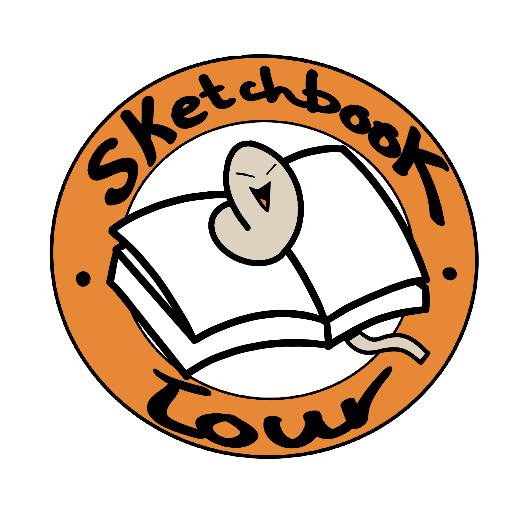
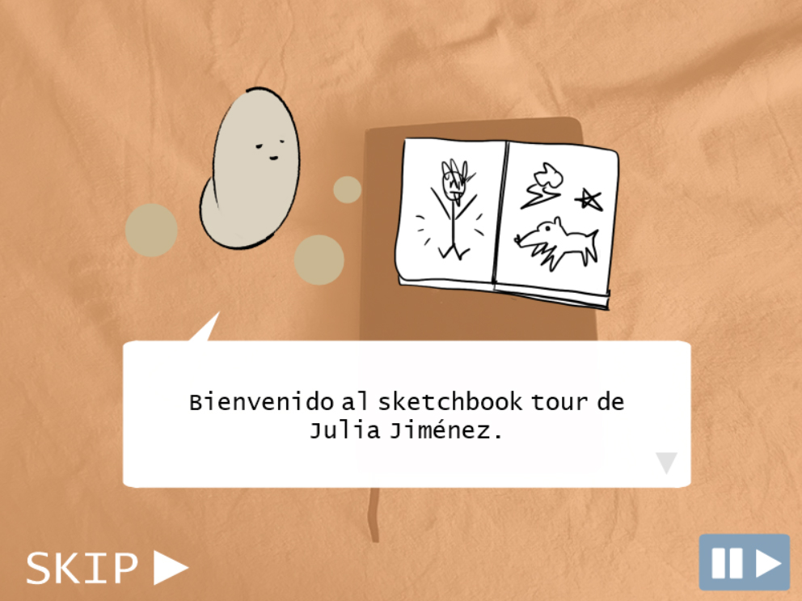
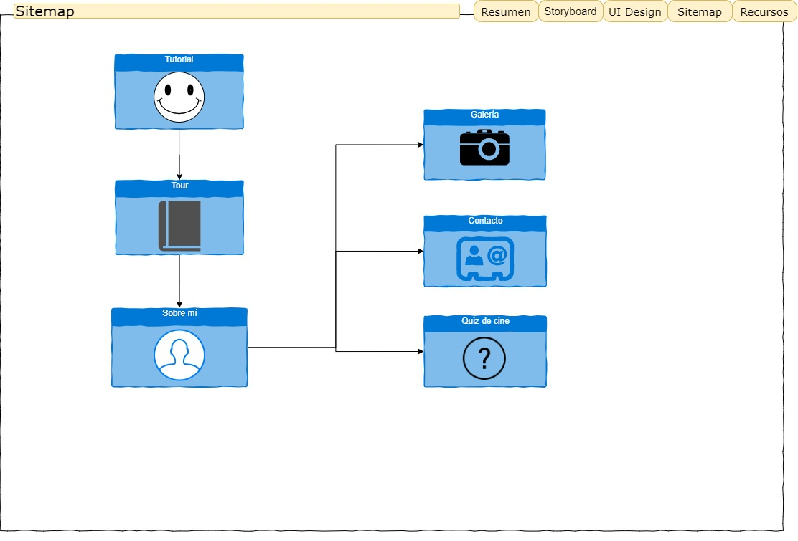

SKETCHBOOK TOUR

Proyecto de Creación Multimedia Interactiva de la Facultad de Bellas Artes de la Universidad de Granada.

**1. Datos**

Titulo: Sketchbook tour.

Web: https://juliajimt.github.io

Autor: Julia Jiménez Torres.

Resumen: se trata de un tour interactivo muy íntimo por mi cuaderno de dibujo. Este objeto es muy personal para mí, ya que lo utilizo para dibujar, como diario de viaje o para guardar recuerdos. De alguna manera, el tour sirve para mostrar lo que hago, aunque no sea un portfolio en el sentido estricto de la palabra.

Estilo/género: portfolio, diario personal.

Logotipo:  
  
 
El logotipo muestra a la mascota de la página sobre un cuaderno. Además, el color predominante es el naranja, muy presente en la página.

Resolución: 800x600px tamaño fijo.

Probado en: ordenadores Windows y Mac, iPad, móvil.

Tamaño proyecto: ???

Licencia: licencia Creative Commons Atribución - Compartir Igual 4.0 Internacional.

Fecha : 14/06/2020

Medios:

Github: https://juliajimt.github.io

Instagram: https://www.instagram.com/jalapegno/

**2. Memoria del proyecto**

**2.1 Storyboard:**

Cuando entras en la página, la mascota del tour te explica cómo navegar por la misma a modo de tutorial. Esta pantalla está inspirada en los cuadros de diálogo presentes en juegos como Pokémon, por ejemplo.

  

A continuación, entras en la parte central del proyecto: se trata del tour en el que puedes navegar por las páginas libremente. En algunas páginas hay puntos en los que puedes clickar para aprender datos curiosos sobre alguno de los dibujos de mano de la mascota del tour. También puedes acceder a ''Sobre mí''.

  

El menú "Sobre mí", aparte de tener información de mi persona, te lleva a contacto, galería de animaciones y quiz (práctica 3).

  
 
  
 
  
 
  

**2.2. Esquema de navegación**

  

**3. Metodología**

**Etapa 1: Ideación de proyecto**

Mi primera idea fue un portfolio, pero se me ocurrió que podía hacer una propuesta más innovadora y opté por hacer un viaje por mi cuaderno. Muchos artistas, especialmente en Instagram, hacen sketchbook tours en formato de vídeo, ya sea en las stories, en el feed o en IGTV. Algunos ejemplos son los sketchbook tours de Estudio Katastrófico o el de IvArt, ambos en Youtube.

Me pareció algo interesante el integrar al espectador en este tipo de tour, convirtiéndose en algo totalmente interactivo. En estos vídeos, el propio artista explica el contenido que se va mostrando en pantalla, pero en mi proyecto es el propio espectador el que hace click en los botones para obtener la información.

El proyecto es interesante porque involucra al espectador, es como si él mismo estuviera pasando las páginas de mi cuaderno y aprendiendo sobre mis dibujos. Otros elementos que enriquecen el tour son, por ejemplo, el tutorial inicial, los sonidos a la hora de pasar las páginas o hacer click en los botones, la opción de reproducir música y el apartado de información personal en el que añado una galería de mis animaciones, además de mi información de contacto en la que se puede hacer click para que te lleve directamente a mi correo, LinkedIn, artstation, etc.

Publico / audiencia: cualquier tipo de audiencia. En el caso del Quiz, está más bien orientado a personas interesadas en el cine y las series.

**Etapa 2: Desarrollo / actividades realizadas**

A la idea inicial del tour por las páginas del proyecto se le ha añadido lo siguiente:

  - Tutorial inicial para aprender los controles básicos, acompañado de una mascota.
  - Galería de vídeos con mis animaciones.
  - Botones con sonidos y música de fondo.
  - Juego con puntuación (quiz de cine), que se corresponde a la práctica 3.

**Etapa 3: Problemas identificados**

Si se pasa muy rápido de una página a otra, puede dar error y saltar a la página que no corresponde. Además, he notado que algunos usuarios piensan que el triángulo parpadeante es donde tienen que pulsar para pasar el diálogo, cuando es el rectángulo en sí (el triángulo es solo decoración que imita el que hay en muchos videojuegos). En el quiz, tuve que optimizar todos los gifs para reducir el tamaño de la película, ya que algunos pesaban varios MB.

**Etapa 4: Conclusiones**

Crear este proyecto ha sido una experiencia muy enriquecedora. Antes no entendía nada de programación, pero gracias a esta asignatura he aprendido nociones básicas de código Javascript, lo cual puede serme útil algún día. Al principio, sobre todo, me frustraba mucho para conseguir lo que buscaba, pero eso hacía el resultado final muy gratificante.

Es un proyecto que podría mejorarse de muchas maneras, pero creo que cubre muy bien los contenidos que se han dado en la asignatura, puesto que he tratado de añadir todo lo que se iba enseñando en clase. Me gustaría conseguir un aspecto más profesional e incluso subirlo junto al resto de mis dibujos a mis redes sociales en el futuro.

Además, trabajar esta temática me ha dado muchas ideas para hacer mi propio portfolio: quizá incorporo elementos interactivos el día que haga mi portfolio profesional.

**Etapa 5: Referencias**

https://www.youtube.com/watch?v=iPYzevdeHG8

https://www.youtube.com/watch?v=PSV6oLDlBeo

https://www.youtube.com/watch?v=1f2tO9SBDmU

**Artículos y blogs **

Crofts, S., Fox, M., Retsema, A. and Williams, B. (2005) Podcasting: A new technology in search of viable business modelsFirst Monday, 10(9). https://doi.org/10.5210/fm.v10i9.1273. Recuperado el 8 de abril de 2020 de: https://journals.uic.edu/ojs/index.php/fm/article/view/1273/1193

Recursos y materiales audiovisuales:

Música:
   - Música de fondo en el tour: Tranquility - prod. Riddiman (música sin copyright)
   - Música del quiz: Animal Crossing New Leaf Original Soundtrack
   - Botones: sound effects sin copyright.

Imágenes: todas las imágenes, exceptuando los gifs de la práctica 3, son de ideación mía (fotos de mi cuaderno, selfies, animaciones) así como el diseño de la mascota. Estos gifs pertenecen a las siguientes series: Juego de Tronos, La Casa de Papel, Star Wars, Cómo conocí a vuestra madre, Friends, Los Vengadores y El Señor de los Anillos.

Tipografía: Lucida Console (Internet safe).

Herramientas utilizadas:

Hippani Animator 5.1

Procreate

Photoshop

Premiere

 Esta obra está bajo una <a rel="license" href="http://creativecommons.org/licenses/by-sa/4.0/">Licencia Creative Commons Atribución-CompartirIgual 4.0 Internacional</a>.

Junio 2020

Ejemplos de otros años: https://github.com/mgea/interart 
